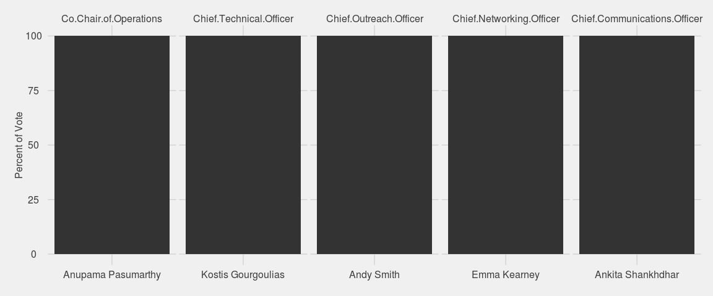
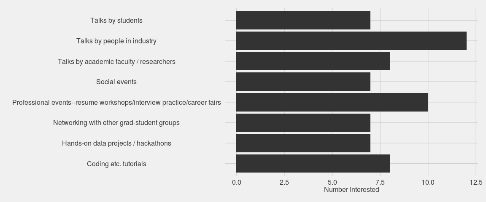
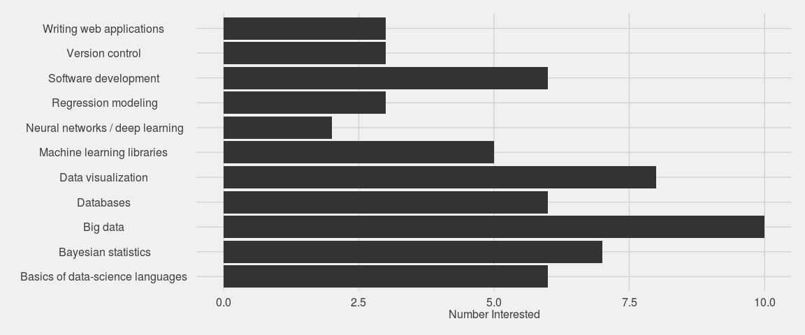

The big news out of GRiD this past week was the interim elections for GRiD club officers. While having a full executive board is very exciting, the election data unfortunately are not--since everybody was running unopposed. Just for fun, I'll do a visualization of results anyway. Plus I'll look at the responses to two survey questions on the election form. All analysis is conducted using R, with figures made using the **ggplot2** package. If you want to have a crack at the data yourself, or just reproduce the analysis herein, you can find the code and data in [this gist](https://gist.github.com/markwh/b55b11f1bd8dc116a365). 

### Step 1: Getting the data

The elections were conducted online using Google Forms, which returns results as a csv file. So loading the data is straightforward:


responses = read.csv("data/responses.csv")


### Step 2: Choosing a ggplot theme 

Since this is a post about elections, I thought I'd go with the "ggthemes::theme_fivethirtyeight" theme, but this doesn't have a y-axis title, so I'll change it accordingly:


library(ggplot2)
library(ggthemes)
theme_grid <- theme_fivethirtyeight()
theme_grid$axis.title = theme_bw()$axis.title
theme_grid$axis.title.x = theme_bw()$axis.title.x
theme_grid$axis.title.y = theme_bw()$axis.title.y 


### Step 3: Plot the election results

The code below produces the plot the follows it. It includes some light preprocessing to get the data into the form that ggplot likes. I won't go into detail about this here; have a look at the documentation for the functions below if you want to know more.


library(reshape2)
library(dplyr)
election <- responses[, 2:6]
eln.m <- melt(election, id.vars = NULL) %>%
  filter(value != "")

eln.m %>%
  group_by(variable, value) %>%
  summarize(n = n(), pct = n() / length(value) * 100) %>%
  ggplot(aes(x = value, y = pct)) +
  geom_bar(stat = "identity") +
  facet_wrap(~variable, scales = "free_x", nr = 1) +
  theme_grid +
  theme(axis.title.x = element_blank()) +
  ylab("Percent of Vote")


 

As I said, not very exciting. Everyone got 100% of the vote. That's what happens when you run unopposed.

### Step 4: Plot the survey responses

Before presenting the survey results, a brief note for future Google Form setup: *don't include commas in checkbox options!*. Google returns the responses to checkbox input for each respondant and question as a as comma-delineated string. Because of this, any commas in the checkbox options, it's impossible for R to disambiguate the delimiter commas from the text commas. For example, here is one person's responses to the question "What kinds of GRiD events are you most interested in?":


responses[8, 8] %>%
  as.character



>> [1] "Talks by people in industry, Hands-on data projects / hackathons, 
Coding, etc. tutorials, Professional events--resume workshops,
 interview practice, career fairs"


Splitting this string by comma yields a character vector of length 7, despite only 4 checkboxes having been selected:


responses[8, 8] %>%
  as.character %>%
  strsplit(split = ", ") %>%
  `[[`(1)



>> [1] "Talks by people in industry"          
>> [2] "Hands-on data projects / hackathons"  
>> [3] "Coding"                               
>> [4] "etc. tutorials"                       
>> [5] "Professional events--resume workshops"
>> [6] "interview practice"                   
>> [7] "career fairs"


To remedy this, I had to manually replace non-separating commas with something else; I chose to use a forward slash. I did this replacement using the `gsub` function and (not so much here as in the next question) appropriately chosen [regular expresions](https://en.wikipedia.org/wiki/Regular_expression). Here is the result of doing this with the first survey question:


fixfun <- function(x) {
  out <- x %>%
    gsub(", etc.", " etc.", x = .) %>%
    gsub("shops, inter", "shops/inter", x = .) %>%
    gsub("tice, career", "tice/career", x = .)
}

surv1 <- responses[, 8] %>% 
  as.character() %>%
  fixfun()


The next survey question had a lot of commas inside of parentheses and only one outside of parentheses. Replacement of the inside-parentheses commas is pretty simple using the right regular expression. Actually, I just did away with the parenthetical statements altogether. 


surv2 <- as.character(responses[, 9]) %>%
  gsub("works, deep", "works / deep", x = .) %>%
  gsub("\\(([^)]+)\\)", "", x = .)


Now that that's fixed, we can finally look at the survey responses!

#### Question 1: *What kinds of GRiD events are you most interested in?*


surv1 %>%
  strsplit(split = ", ") %>%
  unlist() %>%
  as.factor() %>%
  summary() %>%
  data.frame(item = names(.), n = .) %>%
  ggplot(aes(x = item, y = n)) + 
  geom_bar(stat = "identity") +
  theme_grid +
  theme(axis.title.y = element_blank()) +
  coord_flip() +
  ylab("Number Interested")


 

Question 2: *What data science topics do you want to learn (more) about?*


surv2 %>%
  strsplit(", ") %>%
  unlist() %>%
  as.factor() %>%
  summary() %>%
  data.frame(item = names(.), n = .) %>%
  ggplot(aes(x = item, y = n)) + 
  geom_bar(stat = "identity") +
  theme_grid +
  theme(axis.title.y = element_blank()) +
  ylab("Number Interested") +
  coord_flip()


 

Neat! So it looks like GRiD members are most interested in attending talks by people in industry and professional-development events. We'll be sure to host more of these! There is also major interest in learning big data methods (Spark, Hadoop, and the like), data visualization, Bayesian stats, and others. This is great. So many things to get excited about. 

If you are a GRiD member and haven't yet completed the member survey, you can still do that [here](http://goo.gl/forms/t8pPMoAj4K).
